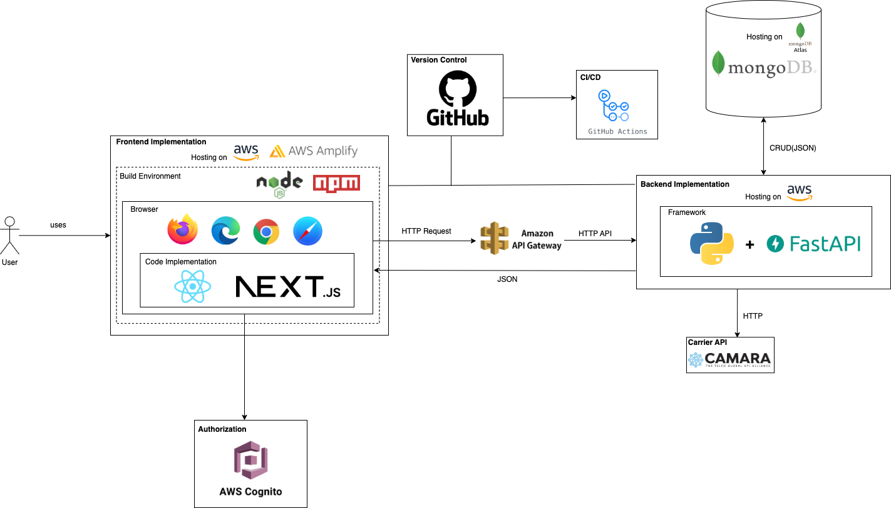

# GoPlanner

GoPlanner is a Next.js travel planning web app for discovering Australian destinations, saving favorite attractions, and generating a personalized trip plan from the user's dates, group details, budget, and selected places.



## Features

- Destination guidebook for Melbourne, Sydney, Brisbane, and Perth
- Attraction browsing with city-specific pages and image-rich cards
- User authentication, profile management, and avatar upload
- Favorite attraction saving backed by MongoDB
- Trip detail form with local autosave
- Smart planning page that combines trip details and selected attractions into an itinerary

## Tech Stack

- **Frontend:** Next.js 15, React 19, TypeScript, Tailwind CSS
- **Backend:** Next.js API routes, Node.js
- **Database:** MongoDB with Mongoose
- **Auth:** JWT-based local API routes
- **Deployment target:** AWS Amplify / AWS hosting flow shown in the architecture guide

## Project Documentation

The full website guidebook is stored as a standalone PDF:

- [OpenGate34 Website Guidebook](./docs/opengate34-website-guidebook.pdf)

PDFs usually should not be embedded directly into a README. A README works best as the quick project entry point, while larger guidebooks, reports, and handover documents should live in a `docs/` directory and be linked from here.

## Getting Started

Install dependencies:

```bash
npm install
```

Create a `.env.local` file in the project root:

```bash
MONGODB_URI=your_mongodb_connection_string
JWT_SECRET=your_jwt_secret
```

Run the development server:

```bash
npm run dev
```

Open [http://localhost:3000](http://localhost:3000) in your browser.

## Available Scripts

```bash
npm run dev
npm run build
npm run start
```

## App Routes

- `/` - home page and destination highlights
- `/guidebook` - guidebook search
- `/guidebook/melbourne` - Melbourne attractions
- `/guidebook/sydney` - Sydney attractions
- `/guidebook/brisbane` - Brisbane attractions
- `/guidebook/perth` - Perth attractions
- `/trip-planner` - trip details and preferences
- `/smart-planning` - generated itinerary view
- `/login`, `/signup`, `/profile` - user account pages

## Repository Structure

```text
src/app/          Next.js app routes and API routes
src/components/   Shared React components
src/contexts/     Auth and toast providers
src/hooks/        Client-side data hooks
src/lib/          Database helpers
src/models/       Mongoose models
public/           Static images and README assets
docs/             Project guidebook and documentation
```

## Notes

- `public/docs/architecture-diagram.png` is used by this README so it renders correctly on GitHub.
- `docs/opengate34-website-guidebook.pdf` is kept as a linked project document instead of being duplicated in the README.
